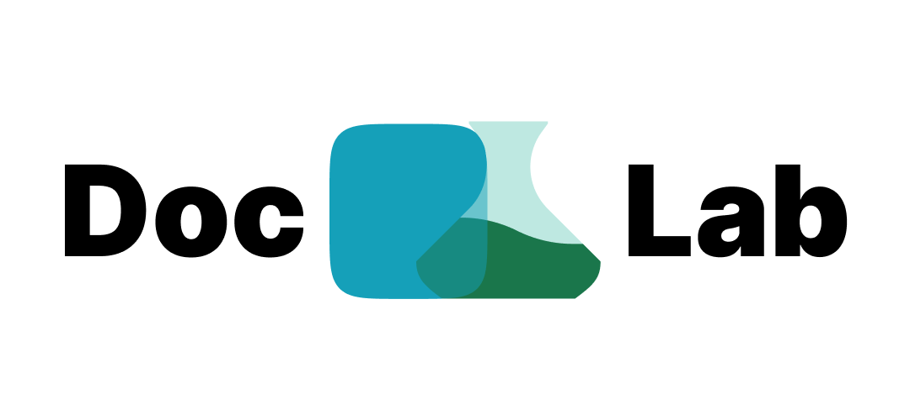

# DocLab

Make easy to create a documentation using markdown.




<!-- <a href="https://github.com/vercel/next.js/blob/canary/license.md"></a> -->
<a href="https://github.com/VirgoLabs/doclab/"></a>
<a href="https://github.com/VirgoLabs/doclab/discussions/"></a>

## Overview

The **DocLab** is a user-friendly application designed to simplify the process of creating and managing documentation using Markdown. Built with Next.js, it offers a seamless experience for both developers and non-developers alike.

## Features

- **Easy Markdown Editing**: Write and edit Markdown with a live preview.
- **Custom Templates**: Choose from various documentation templates.
- **Version Control**: Keep track of changes and revert to previous versions.
- **Export Options**: Export documentation in multiple formats (HTML, PDF, etc.).
- **User Authentication**: Secure access with user accounts and permissions.

## Getting Started

To get started with the Markdown Documentation App, follow these steps:

### Prerequisites

- Node.js (v14 or higher)
- npm (v6 or higher)

### Installation

1. **Clone the Repository**:
   ```bash
   git clone https://github.com/VirgoLabs/doclab.git
   cd doclab
   ```

2. **Install Dependencies**:
   ```bash
   npm install
   ```

3. **Run the Development Server**:
   ```bash
   npm run dev
   ```
   Navigate to `http://localhost:3000` in your browser to view the app.

## Usage

Once the app is running, you can:

- Create a new document using Markdown.
- Edit existing documents with the live preview feature.
- Choose a template for your documentation.
- Save and export your work.

## Contributing

We welcome contributions! Please see our [CONTRIBUTING.md](CONTRIBUTING.md) file for more details on how to get involved.

## Code of Conduct

This project adheres to a [Code of Conduct](CODE_OF_CONDUCT.md). Please read it to understand our expectations for participation.

## Security

If you discover a security vulnerability, please follow the guidelines in our [SECURITY.md](SECURITY.md) document to report it.

## License

This project is licensed under the MIT License. See the [LICENSE](LICENSE) file for more information.

## Contact

For questions or feedback, feel free to reach out via:

- Email: [imparth.dev@gmail.com]
- GitHub: [imparth7](https://github.com/imparth7)

Thank you for checking out the Markdown Documentation App! We hope you find it useful.